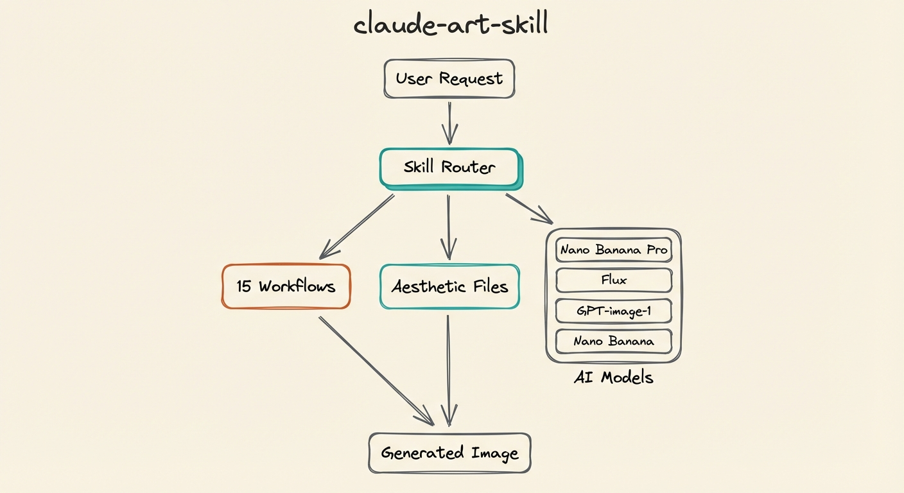

# claude-art-skill

[](https://opensource.org/licenses/MIT)
[](https://docs.anthropic.com/en/docs/claude-code)

Complete visual content system for Claude Code — 16 specialized workflows, 4 AI image models, aesthetic routing, and brand customization.

The default model is **Nano Banana 2** (`gemini-3.1-flash-image-preview`), combining Pro-level quality with Flash speed at ~50% lower cost.



## Installation

Clone the repo into your Claude Code skills directory:

```bash
git clone https://github.com/aplaceforallmystuff/claude-art-skill.git /tmp/claude-art-skill
cp -r /tmp/claude-art-skill/skills/art ~/.claude/skills/art
rm -rf /tmp/claude-art-skill
```

Then install the image generation dependencies:

```bash
cd ~/.claude/skills/art/tools
bun install
```

## Setup

### API Keys

Create `~/.claude/.env` with the API keys for the models you want to use:

```
# Required for Nano Banana 2 and Nano Banana Pro (recommended)
GOOGLE_API_KEY=your-google-api-key

# Required for Flux model
REPLICATE_API_TOKEN=your-replicate-token

# Required for GPT-image-1 model
OPENAI_API_KEY=your-openai-api-key

# Optional — for background removal
REMOVEBG_API_KEY=your-removebg-key
```

You only need the keys for the models you plan to use. Nano Banana 2 (`GOOGLE_API_KEY`) is the default.

## Usage

Once installed, tell Claude Code to generate images:

- "Create a blog header illustration about AI automation"
- "Make a technical diagram of this architecture"
- "Generate a comparison visual: React vs Vue"
- "Create a timeline of the project milestones"
- "Edit this image — remove the background clutter"

The skill automatically routes to the appropriate workflow based on your request.

## Models

| Model | Provider | Cost/Image | Best For |
|-------|----------|-----------|----------|
| **nano-banana-2** (default) | Google Gemini | ~$0.067 | Fast iteration, most tasks, web search grounding |
| **nano-banana-pro** | Google Gemini | ~$0.134 | Maximum reasoning, complex multi-turn editing |
| **gpt-image-1** | OpenAI | varies | Text rendering in images, precise literal interpretation |
| **flux** | Replicate | varies | Maximum photorealism, complex scenes |

### Nano Banana 2 Highlights

Nano Banana 2 (`gemini-3.1-flash-image-preview`) is the recommended default:

- **Pro-level quality at Flash speed** — roughly 50% cheaper than Nano Banana Pro
- **Web search grounding** — real-time web + image search for accurate logos, landmarks, brand identities
- **Precision text rendering** — accurate, legible text for mockups, cards, infographics
- **In-image translation** — localize text across languages
- **Subject consistency** — up to 5 characters and 14 objects with high fidelity
- **512px to 4K resolution** — from fast cheap previews to production quality
- **Configurable thinking** — `minimal` (default) or `high` for complex compositions
- **Extended aspect ratios** — 1:4, 4:1, 1:8, 8:1, 2:3, 3:4, 4:5, 5:4 (in addition to standard ratios)

For more details, see the [Gemini API image generation docs](https://ai.google.dev/gemini-api/docs/image-generation).

## CLI Examples

### Basic generation

```bash
bun run ~/.claude/skills/art/tools/generate-image.ts \
  --prompt "Hand-drawn sketch of interconnected nodes on cream background" \
  --size 2K \
  --aspect-ratio 16:9 \
  --output /tmp/header.png
```

### Quick preview at 512px (fast, cheap)

```bash
bun run ~/.claude/skills/art/tools/generate-image.ts \
  --prompt "Isometric diorama of a home office" \
  --size 512px \
  --output /tmp/preview.png
```

### Using thinking for complex compositions

```bash
bun run ~/.claude/skills/art/tools/generate-image.ts \
  --prompt "Technical architecture diagram showing 5 microservices connected by arrows, labeled, LEFT TO RIGHT flow" \
  --thinking high \
  --size 2K \
  --aspect-ratio 16:9 \
  --output /tmp/architecture.png
```

### With a reference image for style transfer

```bash
bun run ~/.claude/skills/art/tools/generate-image.ts \
  --prompt "Apply this visual style to a portrait of a lighthouse at sunset" \
  --reference-image /path/to/style-reference.png \
  --size 2K \
  --output /tmp/styled.png
```

### Using Nano Banana Pro for multi-turn refinement

```bash
bun run ~/.claude/skills/art/tools/generate-image.ts \
  --model nano-banana-pro \
  --prompt "Product photo of a ceramic mug on marble surface, soft shadows" \
  --size 4K \
  --aspect-ratio 1:1 \
  --output /tmp/product.png
```

### Creative variations (generates 4 options)

```bash
bun run ~/.claude/skills/art/tools/generate-image.ts \
  --prompt "Abstract representation of data flowing through a neural network" \
  --creative-variations \
  --output /tmp/variations.png
```

### Web search grounded generation (accurate logos, landmarks, brands)

```bash
bun run ~/.claude/skills/art/tools/generate-image.ts \
  --prompt "The Sagrada Familia cathedral in Barcelona at golden hour, photorealistic" \
  --grounded \
  --size 2K \
  --output /tmp/sagrada.png
```

### Background removal

```bash
bun run ~/.claude/skills/art/tools/generate-image.ts \
  --prompt "Cartoon mascot character" \
  --remove-bg \
  --output /tmp/mascot-nobg.png
```

### All CLI options

```
--model          Model to use (nano-banana-2, nano-banana-pro, gpt-image-1, flux)
--prompt         Image generation prompt (required)
--size           Output size (512px, 1K, 2K, 4K) — 512px is NB2 only
--aspect-ratio   Aspect ratio (1:1, 16:9, 9:16, 4:3, 3:2, 21:9, and NB2 extended)
--output         Output file path (required)
--reference-image  Reference image for style transfer (Gemini models only)
--thinking       Thinking level: minimal, high (NB2 only)
--grounded       Enable web search grounding (NB2 only) — accurate logos, landmarks, brands
--transparent    Request transparent background (gpt-image-1 only)
--remove-bg      Remove background after generation (requires REMOVEBG_API_KEY)
--creative-variations  Generate 4 creative variations
--help           Show help
```

## Available Workflows

| Workflow | Trigger |
|----------|---------|
| Editorial illustration | Blog headers, article visuals |
| Visualize (orchestrator) | When unsure which format |
| Mermaid | Flowcharts, sequence diagrams |
| Technical diagrams | Architecture, system diagrams |
| Taxonomies | Classification grids |
| Timelines | Chronological progressions |
| Frameworks | 2x2 matrices, mental models |
| Comparisons | X vs Y, side-by-side |
| Annotated screenshots | Screenshot markup |
| Recipe cards | Step-by-step processes |
| Sketchnotes | Visual notes, meeting summaries |
| Aphorisms | Quote cards |
| Maps | Conceptual territory maps |
| Stats | Big number visuals |
| Comics | Sequential panels |
| Image editing | Modify existing images |

## Adding Your Own Brand Aesthetic

The skill ships with a warm hand-drawn sketch aesthetic as default. To add your own brand:

1. Create a new file at `skills/art/aesthetics/your-brand.md`
2. Define your brand colors, line style, composition rules, and mood
3. Define a **Base Prompt Prefix** — the consistency lock that ensures all your images look cohesive
4. When generating, tell Claude which brand to use: "Create a header using my-brand aesthetic"

See `skills/art/aesthetic.md` for the default example format.

## Further Reading

- [Gemini API image generation docs](https://ai.google.dev/gemini-api/docs/image-generation) — full API reference for parameters, thinking config, aspect ratios, reference images, and multi-turn editing
- [Nano Banana prompting guide](skills/art/nano-banana-guide.md) — detailed prompt formulas, action verbs, mood vocabulary, and brand integration templates

## License

MIT
